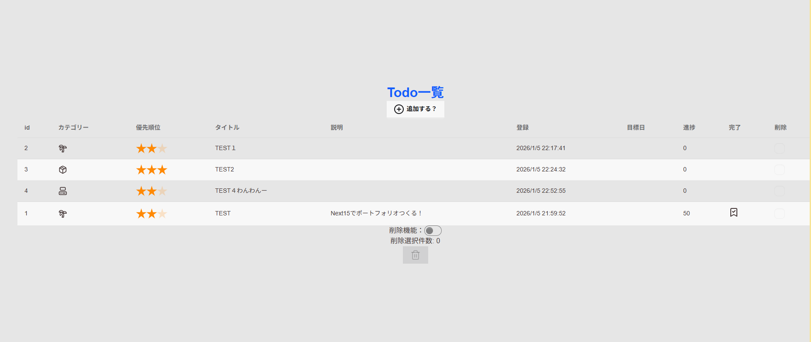

# Todo list 一覧 仕様

### 概要

Todo 一覧表示。新規追加・削除機能を配置。更新は画面から実行。

### 画面レイアウト

-   PC
    

-   SmartPhone

### 使用コンポーネント

-   prisma
-   TodoList

### 項目定義

**表示場所**

| カラム名   | 型      | 必須 | 備考       |
| :--------- | :------ | :--- | :--------- |
| id         | Int     | ★    |            |
| カテゴリー | String  | ★    |            |
| 優先順位   | Int     | ★    | 値で ★     |
| タイトル   | String  | ★    |            |
| 説明       | String  |      |            |
| 登録       | Date    |      |            |
| 目標日     | Date    |      |            |
| 進捗       | Int     | ★    | 初期:0     |
| 完了       | Boolean | ★    | 初期:false |
| 削除       | Boolean |      | 削除用     |

### 実装予定

-   デザイン
-   スマートフォン
-   管理画面
